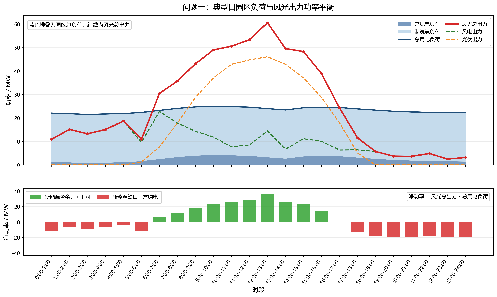
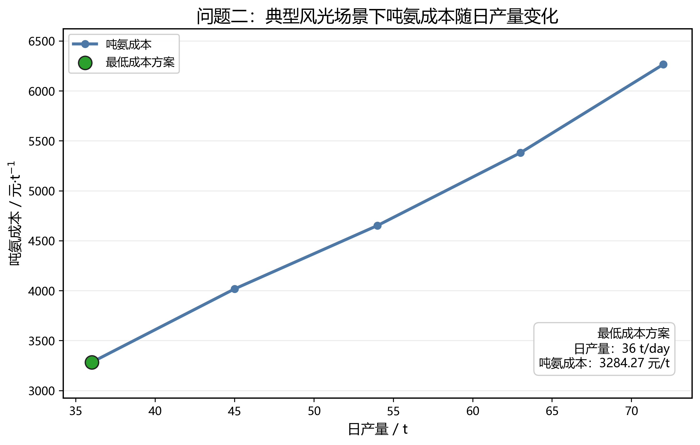
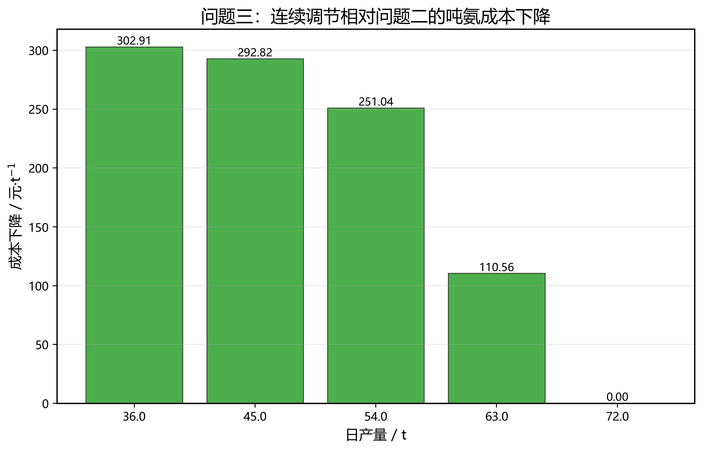
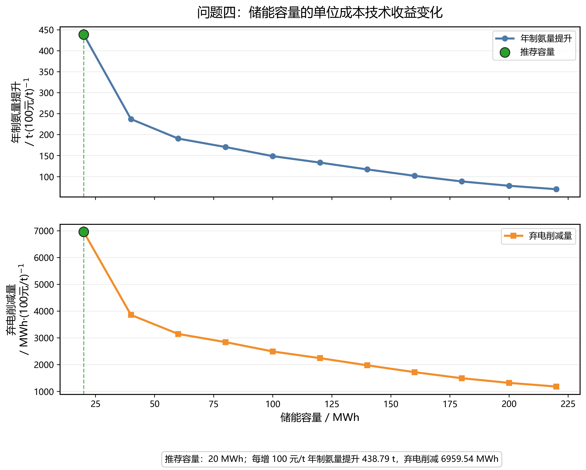
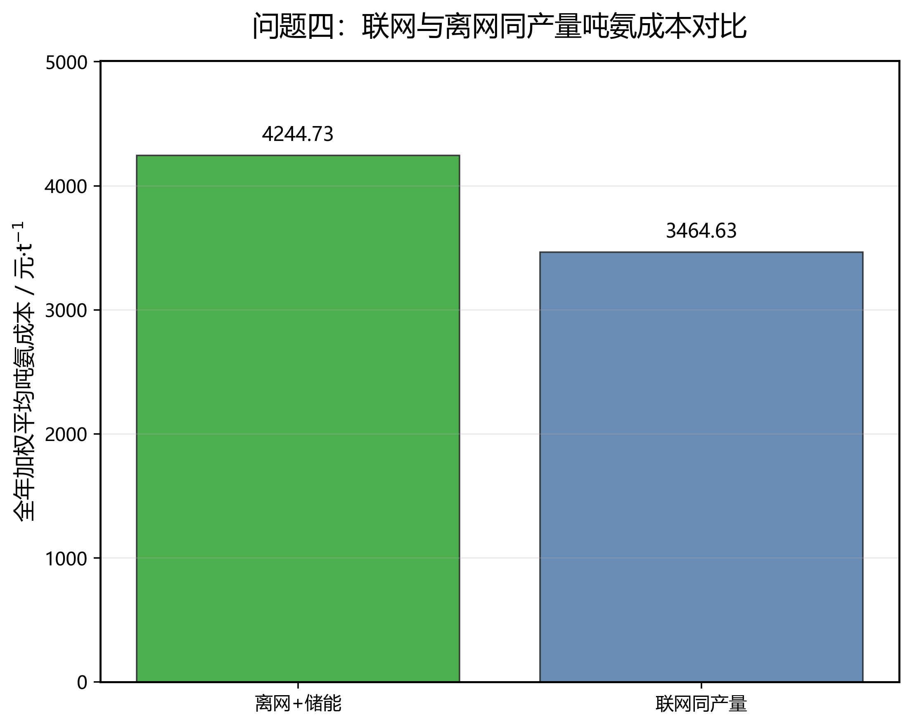

# DGcup

电工杯 A 题项目：面向园区风光制氢合成氨系统的运行分析与优化建模。

本项目围绕“风电—光伏—制氢—合成氨”综合能源系统，建立统一的小时级功率平衡与成本核算框架，依次完成：

- **问题一**：典型日基准核算与绿电指标校验；
- **问题二**：离散制氨负荷调度优化；
- **问题三**：连续制氨负荷调度优化；
- **问题四**：离网运行与储能容量技术经济分析。

项目的核心目标不是孤立地解决单个小问，而是构建一个统一的系统优化框架，回答以下关键问题：

1. 当前园区典型日运行是否满足绿电直连政策指标；
2. 制氨负荷如何调度才能降低吨氨成本；
3. 连续调节相比离散调节能带来多少系统收益；
4. 离网场景下储能容量应如何在产量、弃电与成本之间折中配置。

---

## 核心结果总览

### 问题一：典型日功率平衡

<p align="center">
  
</p>

### 问题二：离散制氨调度成本对比

<p align="center">
  
</p>

### 问题三：连续调节相对离散调节的成本下降

<p align="center">
  
</p>

### 问题四：储能容量单位成本技术收益

<p align="center">
  
</p>

### 问题四：联网与离网同产量成本对比

<p align="center">
  
</p>

---

## 核心符号与核心公式

### 1. 功率平衡主方程

联网场景下，系统满足：

```math
P_{\mathrm{wind}}(t)+P_{\mathrm{pv}}(t)+P_{\mathrm{buy}}(t)
=
P_{\mathrm{base}}(t)+P_{\mathrm{NH3}}(t)+P_{\mathrm{sell}}(t)
```

离网储能场景下，系统满足：

```math
P_{\mathrm{RE}}(t)+P_{\mathrm{dis}}(t)+P_{\mathrm{unserved}}(t)
=
P_{\mathrm{base}}(t)+P_{\mathrm{NH3}}(t)+P_{\mathrm{ch}}(t)+P_{\mathrm{curt}}(t)
```

其中：

- $`P_{\mathrm{base}}(t)`$：园区常规负荷；
- $`P_{\mathrm{NH3}}(t)`$：制氢合成氨负荷；
- $`P_{\mathrm{buy}}(t), P_{\mathrm{sell}}(t)`$：电网购电与余电上网；
- $`P_{\mathrm{ch}}(t), P_{\mathrm{dis}}(t)`$：储能充放电功率；
- $`P_{\mathrm{curt}}(t)`$：弃电功率；
- $`P_{\mathrm{unserved}}(t)`$：缺供功率。

### 2. 吨氨成本

吨氨成本统一定义为：

```math
C_{\mathrm{NH3}}
=
\frac{
C_{\mathrm{wind}}+C_{\mathrm{pv}}+C_{\mathrm{grid}}+C_{\mathrm{om}}+C_{\mathrm{capex}}
}{
Q_{\mathrm{NH3}}
}
```

其中：

- $`C_{\mathrm{wind}}, C_{\mathrm{pv}}`$：风电、光伏发电成本；
- $`C_{\mathrm{grid}}`$：电网购售电净成本；
- $`C_{\mathrm{om}}`$：设备运维成本；
- $`C_{\mathrm{capex}}`$：设备年化折旧成本；
- $`Q_{\mathrm{NH3}}`$：氨产量。

### 3. 绿电直连指标

按照发改能源〔2025〕650 号文件口径，本文采用以下三项指标：

绿电自发自用比例：

```math
R_{\mathrm{self}}
=
\frac{
E_{\mathrm{RE,self}}
}{
E_{\mathrm{RE,total}}
}
```

绿电消费比例：

```math
R_{\mathrm{green}}
=
\frac{
E_{\mathrm{RE,self}}
}{
E_{\mathrm{load}}
}
```

余电上网比例：

```math
R_{\mathrm{export}}
=
\frac{
E_{\mathrm{sell}}
}{
E_{\mathrm{RE,total}}
}
```

其中：

```math
E_{\mathrm{RE,self}} = E_{\mathrm{RE,total}} - E_{\mathrm{sell}} - E_{\mathrm{curt}}
```

### 4. 储能状态方程

储能荷电状态满足：

```math
SOC(t+1)
=
(1-\sigma)SOC(t)
+\eta_{\mathrm{ch}}P_{\mathrm{ch}}(t)
-\frac{P_{\mathrm{dis}}(t)}{\eta_{\mathrm{dis}}}
```

其中：

- $`\eta_{\mathrm{ch}}=0.9`$：充电效率；
- $`\eta_{\mathrm{dis}}=0.9`$：放电效率；
- $`\sigma=0.002`$：自损耗率。

### 5. 储能容量技术经济评价指标

以无储能方案为基准，定义：

```math
\Delta Q(E)=Q(E)-Q(0)
```

```math
\Delta K(E)=K(0)-K(E)
```

```math
\Delta C(E)=C_{\mathrm{NH3}}(E)-C_{\mathrm{NH3}}(0)
```

进一步定义：

单位成本年制氨量提升：

```math
\eta_Q(E)=
\frac{
\Delta Q(E)
}{
\Delta C(E)/100
}
```

单位成本弃电削减量：

```math
\eta_K(E)=
\frac{
\Delta K(E)
}{
\Delta C(E)/100
}
```

其中：

- $`\eta_Q(E)`$：每增加 100 元/t 吨氨成本可换来的年制氨量提升；
- $`\eta_K(E)`$：每增加 100 元/t 吨氨成本可换来的全年弃电削减量。

根据容量扫描结果，本文将：

- **20 MWh** 识别为技术经济**膝点容量**；
- **160 MWh** 识别为技术**饱和容量**。

---

## 项目结构

```text
DGcup/
├─ configs/
│  └─ config.yaml
├─ data/
│  └─ raw/                         # 官方原始 Excel 附件
├─ outputs/
│  ├─ figures/                     # Q1-Q4 主要可视化图
│  └─ tables/                      # 结果表与敏感性分析表
├─ scripts/
│  ├─ run_q1_baseline.py
│  ├─ run_q2_discrete.py
│  ├─ run_q3_continuous.py
│  ├─ run_q4_storage.py
│  └─ run_sensitivity_analysis.py
├─ src/dgcup/
│  ├─ core/                        # 功率平衡、指标、成本核算
│  ├─ data/                        # Excel 读取与场景构建
│  ├─ optimization/                # Q2/Q3/Q4 优化模型
│  ├─ visualization/               # 绘图函数
│  └─ utils/
├─ README.md
└─ requirements.txt
```

---

## 数据文件

官方附件统一放在：

```text
data/raw/
```

需要包含附件 1 至附件 8 的 Excel 文件。项目当前已将原始数据、结果表和主要图像纳入仓库，便于复现实验与展示。

---

## Q2 离散调度模型说明

Q2 可以形式化为 0-1 离散调度问题。设 $`x_t=1`$ 表示第 $`t`$ 小时制氢氨装置满负荷运行，$`x_t=0`$ 表示停机。在给定日制氨量 $`Q_{\mathrm{NH3}}`$ 下，所需开机小时数为：

```math
H=\frac{Q_{\mathrm{NH3}}}{3}
```

对应优化模型为：

```math
\min_{x_t}\sum_{t=1}^{24}\Delta c_t x_t
```

```math
\sum_{t=1}^{24}x_t=H,\qquad x_t\in\{0,1\}
```

由于 Q2 不含储能状态、爬坡约束和最小开停机时间，目标函数按小时可分离。因此代码采用等价精确排序算法：计算每小时开机相对停机的增量成本 $`\Delta c_t`$，选择增量成本最低的 $`H`$ 个小时，即可得到全局最优解。

---

## Q3 连续调节模型说明

Q3 将制氢氨装置功率由离散满开/停机扩展为连续可调。设 $`u_t`$ 为制氢氨功率比例，$`y_t`$ 为开机状态，则：

```math
0.1y_t\le u_t\le y_t,\qquad y_t\in\{0,1\}
```

```math
P_{\mathrm{NH3}}(t)=41.5u_t
```

```math
q_{\mathrm{NH3}}(t)=3u_t
```

连续调节能够在高风光时段提高制氨负荷，在低风光或高电价时段降低负荷，从而缓解源荷错配并降低全年吨氨成本。

---

## Q4 储能容量选择准则

储能容量选择不采用主观加权综合得分，而是以无储能方案为基准，分别计算单位成本下的年制氨量提升和弃电削减量。

设储能容量为 $`E`$，无储能方案为 $`E=0`$，定义：

```math
\Delta Q(E)=Q(E)-Q(0)
```

```math
\Delta K(E)=K(0)-K(E)
```

```math
\Delta C(E)=C_{\mathrm{NH3}}(E)-C_{\mathrm{NH3}}(0)
```

单位成本年制氨量提升：

```math
\eta_Q(E)=\frac{\Delta Q(E)}{\Delta C(E)/100}
```

单位成本弃电削减量：

```math
\eta_K(E)=\frac{\Delta K(E)}{\Delta C(E)/100}
```

容量扫描结果显示，20 MWh 同时取得最高单位成本增产收益和最高单位成本弃电削减收益，因此识别为**技术经济膝点容量**；160 MWh 是最大弃电场景下达到最大日制氨量 99% 的最小容量，因此识别为**技术饱和容量**。

---

## 主要数值结果

### Q1 典型日结果

| 指标 | 数值 |
|---|---:|
| 总用电量 | 558.7200 MWh |
| 新能源发电量 | 603.4480 MWh |
| 网购电量 | 172.0438 MWh |
| 上网电量 | 216.7718 MWh |
| 新能源自发自用比例 | 64.0778% |
| 总用电量绿电比例 | 69.2075% |
| 新能源上网比例 | 35.9222% |
| 吨氨成本 | 4368.63 元/tNH3 |

Q1 表明：绿电消费比例满足要求，但新能源上网比例超过 20%，说明连续满负荷运行下存在明显源荷时序错配。

---

### Q2/Q3 年化结果

| 日制氨量 | Q2 年均吨氨成本 | Q3 年均吨氨成本 | Q3 相对 Q2 降本 |
|---:|---:|---:|---:|
| 72 t/day | 7228.97 | 7228.97 | 0.00 |
| 63 t/day | 6576.18 | 6465.63 | 110.56 |
| 54 t/day | 5971.38 | 5720.35 | 251.04 |
| 45 t/day | 5364.39 | 5071.57 | 292.82 |
| 36 t/day | 4586.42 | 4283.50 | 302.91 |

Q3 连续调节相对 Q2 离散调度具有稳定降本效果，尤其在中低产量区间降本更明显。

---

### Q4 离网储能结果

| 模式 | 年制氨量 / t | 产能利用率 | 吨氨成本 / 元/t | 年弃电量 / MWh | 平均缺供量 / MWh |
|---|---:|---:|---:|---:|---:|
| 离网无储能 | 9781.56 | 37.74% | 4178.99 | 14188.67 | 0.0230 |
| 离网 + 20 MWh 储能 | 10070.01 | 38.85% | 4244.73 | 9613.57 | 0 |
| 离网 + 160 MWh 储能 | 10623.84 | 40.99% | 5005.18 | 0 | 0 |
| 联网同产量 | 10070.01 | 38.85% | 3464.63 | — | — |

其中，联网同产量是指在每个风光场景下，联网模式生产与“离网 + 20 MWh 储能”相同的制氨量。因此二者年制氨量和产能利用率相同是模型设计结果，不是计算异常。

在相同年制氨量 10070.01 t 条件下，联网模式吨氨成本比离网储能模式低：

```math
4244.73-3464.63=780.10\ \mathrm{元/t}
```

说明储能可以提升离网自治能力和新能源本地消纳能力，但公共电网仍具有显著的低成本系统平衡价值。

---

## 敏感性分析与稳健性检验

敏感性分析保存在：

```text
outputs/tables/sensitivity_summary.csv
```

本文测试四类关键扰动：储能投资成本、储能 C-rate、储能效率和风光资源整体扰动。结果如下。

| 敏感因素 | 取值范围 | 推荐容量 | 主要结论 |
|---|---:|---:|---|
| 储能投资成本倍率 | 0.6–1.4 | 20 MWh | 成本越高，单位成本增产收益和弃电削减收益递减，但膝点容量保持稳定。 |
| 储能 C-rate | 0.5–2.0 | 20 MWh | 推荐容量对功率倍率不敏感，当前小时级调度下能量容量约束更主导。 |
| 储能效率 | 85%–95% | 20 MWh | 效率越高，吨氨成本越低，单位成本技术收益越高。 |
| 风光出力扰动 | 0.9–1.1 | 20 MWh | 推荐容量保持稳定，联网同产量经济优势始终存在。 |

代表性数值如下。

| 场景 | 推荐容量 | 离网储能吨氨成本 | 联网同产量吨氨成本 | 联网成本优势 | 单位成本增产收益 | 单位成本弃电削减 |
|---|---:|---:|---:|---:|---:|---:|
| 储能成本 0.6 倍 | 20 | 4191.77 | 3464.63 | 727.14 | 2257.80 | 35810.20 |
| 储能成本 1.0 倍 | 20 | 4244.73 | 3464.63 | 780.10 | 438.79 | 6959.54 |
| 储能成本 1.4 倍 | 20 | 4297.69 | 3464.63 | 833.07 | 243.01 | 3854.30 |
| 0.5C | 20 | 4244.74 | 3464.62 | 780.11 | 438.74 | 6960.07 |
| 2.0C | 20 | 4244.73 | 3464.63 | 780.10 | 438.79 | 6959.54 |
| 储能效率 85% | 20 | 4247.97 | 3460.41 | 787.56 | 399.78 | 6804.32 |
| 储能效率 95% | 20 | 4241.51 | 3468.88 | 772.63 | 481.95 | 7149.18 |
| 风光出力 0.9 倍 | 20 | 4244.88 | 3578.49 | 666.39 | 438.59 | 6865.78 |
| 风光出力 1.1 倍 | 20 | 4253.48 | 3363.02 | 890.46 | 554.38 | 8939.03 |

敏感性分析说明：20 MWh 技术经济膝点容量不是由单一参数偶然得到，而是在多种关键扰动下均保持稳定；联网同产量方案在所有扰动场景中仍保持 666.39–890.46 元/t 的成本优势。

---
## 鲁棒性检验

在参数敏感性分析之外，本文进一步进行输入扰动和场景结构鲁棒性检验，包括风光逐小时随机扰动、常规负荷随机扰动、风光负荷联合扰动、场景留一检验以及极端压力测试。

| 测试类型 | 样本数 | 推荐容量众数 | 推荐容量范围 | 联网成本优势为正比例 | 零缺供比例 | 平均联网成本优势 / 元·t⁻¹ |
|---|---:|---:|---:|---:|---:|---:|
| 风光 ±5% 随机扰动 | 3 | 20 MWh | 20–20 MWh | 100% | 100% | 781.69 |
| 风光 ±10% 随机扰动 | 3 | 20 MWh | 20–20 MWh | 100% | 100% | 781.80 |
| 负荷 ±5% 随机扰动 | 3 | 20 MWh | 20–20 MWh | 100% | 100% | 779.92 |
| 风光 ±10% + 负荷 ±5% | 3 | 20 MWh | 20–20 MWh | 100% | 100% | 776.85 |
| 场景留一检验 | 24 | 20 MWh | 20–20 MWh | 100% | 100% | 779.92 |
| 极端压力测试 | 4 | 20 MWh | 20–20 MWh | 100% | 100% | 751.28 |

鲁棒性检验表明，20 MWh 技术经济膝点容量对风光出力扰动、负荷扰动、场景组合变化和极端压力情形均保持稳定；联网同产量方案在所有测试组中均保持正的成本优势。
## 运行方式

安装依赖：

```bash
pip install -r requirements.txt
```

依次运行主模型：

```bash
python scripts/run_q1_baseline.py
python scripts/run_q2_discrete.py
python scripts/run_q3_continuous.py
python scripts/run_q4_storage.py
```

运行敏感性分析：

```bash
python scripts/run_sensitivity_analysis.py
```

结果输出位置：

```text
outputs/tables/
outputs/figures/
```

---

## 建模原则

1. **统一功率平衡**：Q1–Q4 均建立在小时级功率平衡之上；
2. **统一绿电指标**：绿电自发自用比例、绿电消费比例、余电上网比例采用统一口径；
3. **统一成本口径**：吨氨成本包含风光发电成本、购售电成本、设备运维和年化折旧；
4. **多场景年化评价**：24 种风光组合场景按每个场景 15 天折算为全年 360 天；
5. **区分技术饱和与经济膝点**：20 MWh 表征单位成本技术收益最高，160 MWh 表征接近最大产量的技术饱和；
6. **敏感性支撑结论**：通过储能成本、效率、C-rate 和风光扰动验证核心结论稳健性。
