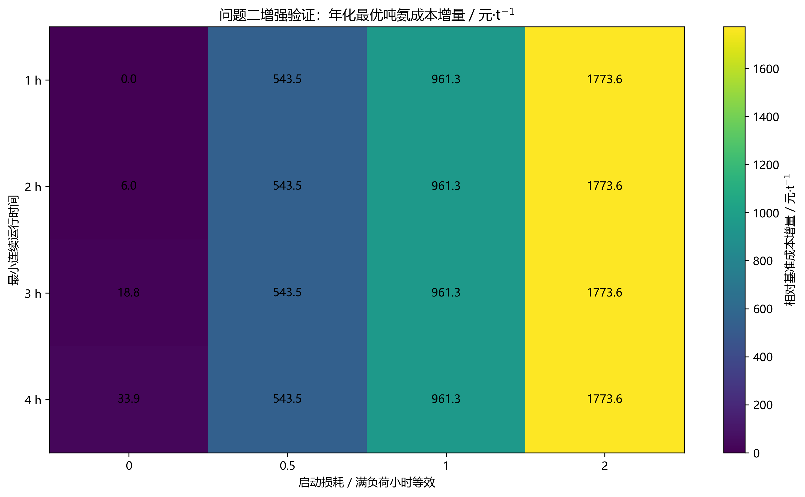
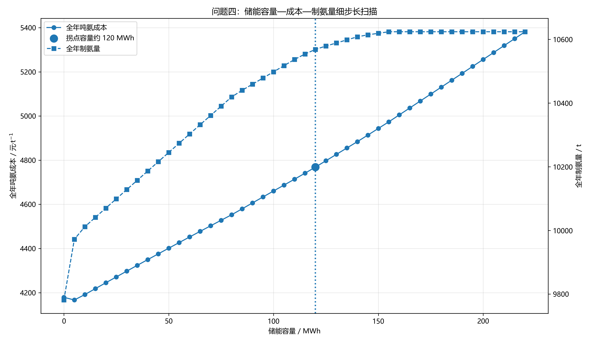
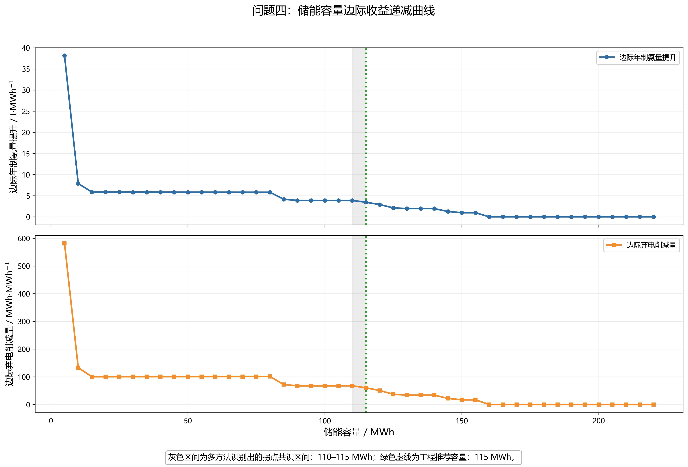
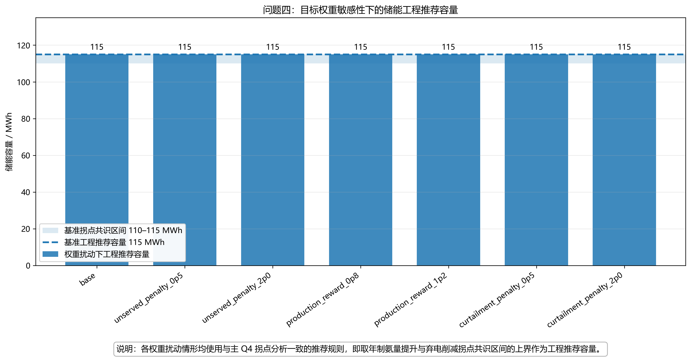
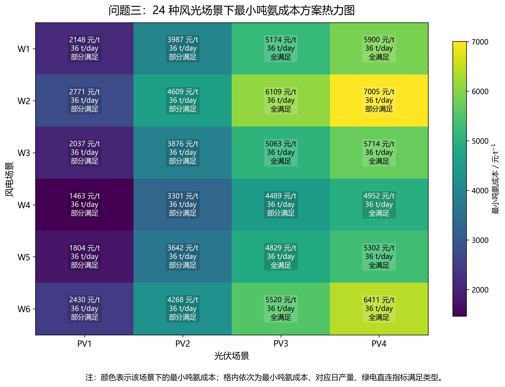
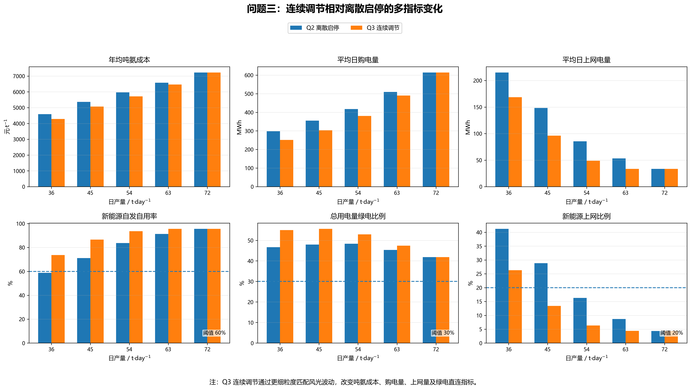
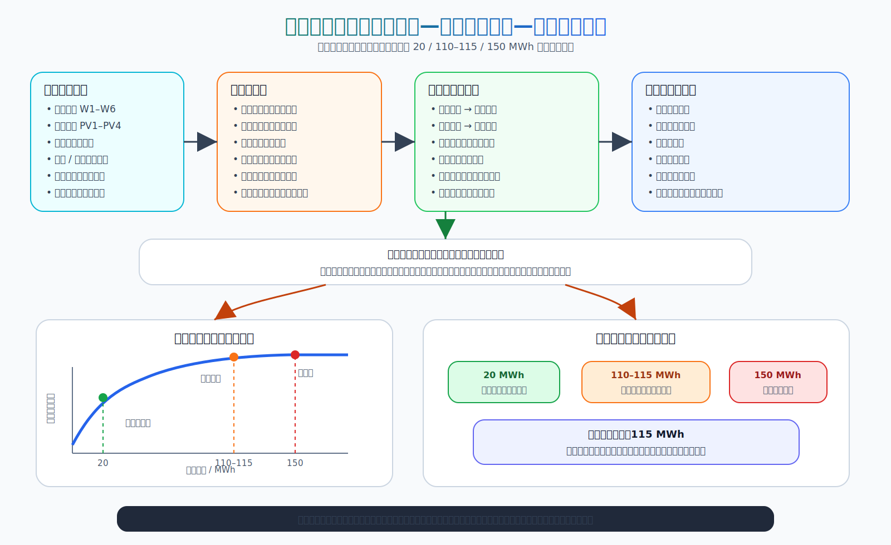

# DGcup

电工杯 A 题项目：面向园区风光制氢合成氨系统的运行分析与优化建模。

本项目围绕“风电—光伏—制氢—合成氨”综合能源系统，建立统一的小时级功率平衡与成本核算框架，依次完成：

- **问题一**：典型日基准核算与绿电指标校验；
- **问题二**：离散制氨负荷调度优化与运行惯性增强验证；
- **问题三**：连续制氨负荷调度优化；
- **问题四**：离网运行与储能容量技术经济分析。

项目的核心目标不是孤立地解决单个小问，而是构建一个统一的系统优化框架，回答以下关键问题：

1. 当前园区典型日运行是否满足绿电直连政策指标；
2. 制氨负荷如何调度才能降低吨氨成本，并检验该结论是否受启动损耗和最小连续运行时间影响；
3. 连续调节相比离散调节能带来多少系统收益；
4. 离网场景下储能容量应如何在产量、弃电与成本之间折中配置。

---

## 核心结果总览

### 问题一：典型日功率平衡

<p align="center">
  
</p>

### 问题二：离散制氨调度成本对比

<p align="center">
  
</p>

### 问题二：运行惯性增强验证

<p align="center">
  
</p>

### 问题三：连续调节相对离散调节的成本下降

<p align="center">
  
</p>

### 问题四：储能容量—成本—制氨量细步长扫描

<p align="center">
  
</p>

### 问题四：储能容量边际收益递减曲线

<p align="center">
  
</p>

### 问题四：联网与离网同产量成本对比

<p align="center">
  
</p>

### 问题四：目标权重敏感性下的推荐容量稳定性

<p align="center">
  
</p>


---

## 核心符号与核心公式

### 1. 功率平衡主方程

联网场景下，系统满足：

```math
P_{\mathrm{wind}}(t)+P_{\mathrm{pv}}(t)+P_{\mathrm{buy}}(t)
=
P_{\mathrm{base}}(t)+P_{\mathrm{NH3}}(t)+P_{\mathrm{sell}}(t)
```

离网储能场景下，系统满足：

```math
P_{\mathrm{RE}}(t)+P_{\mathrm{dis}}(t)+P_{\mathrm{unserved}}(t)
=
P_{\mathrm{base}}(t)+P_{\mathrm{NH3}}(t)+P_{\mathrm{ch}}(t)+P_{\mathrm{curt}}(t)
```

其中：

- $`P_{\mathrm{base}}(t)`$：园区常规负荷；
- $`P_{\mathrm{NH3}}(t)`$：制氢合成氨负荷；
- $`P_{\mathrm{buy}}(t), P_{\mathrm{sell}}(t)`$：电网购电与余电上网；
- $`P_{\mathrm{ch}}(t), P_{\mathrm{dis}}(t)`$：储能充放电功率；
- $`P_{\mathrm{curt}}(t)`$：弃电功率；
- $`P_{\mathrm{unserved}}(t)`$：缺供功率。

### 2. 吨氨成本

吨氨成本统一定义为：

```math
C_{\mathrm{NH3}}
=
\frac{
C_{\mathrm{wind}}+C_{\mathrm{pv}}+C_{\mathrm{grid}}+C_{\mathrm{om}}+C_{\mathrm{capex}}
}{
Q_{\mathrm{NH3}}
}
```

其中：

- $`C_{\mathrm{wind}}, C_{\mathrm{pv}}`$：风电、光伏发电成本；
- $`C_{\mathrm{grid}}`$：电网购售电净成本；
- $`C_{\mathrm{om}}`$：设备运维成本；
- $`C_{\mathrm{capex}}`$：设备年化折旧成本；
- $`Q_{\mathrm{NH3}}`$：氨产量。

### 3. 绿电直连指标

按照发改能源〔2025〕650 号文件口径，本文采用以下三项指标：

绿电自发自用比例：

```math
R_{\mathrm{self}}
=
\frac{
E_{\mathrm{RE,self}}
}{
E_{\mathrm{RE,total}}
}
```

绿电消费比例：

```math
R_{\mathrm{green}}
=
\frac{
E_{\mathrm{RE,self}}
}{
E_{\mathrm{load}}
}
```

余电上网比例：

```math
R_{\mathrm{export}}
=
\frac{
E_{\mathrm{sell}}
}{
E_{\mathrm{RE,total}}
}
```

其中：

```math
E_{\mathrm{RE,self}} = E_{\mathrm{RE,total}} - E_{\mathrm{sell}} - E_{\mathrm{curt}}
```

### 4. 储能状态方程

储能荷电状态满足：

```math
SOC(t+1)
=
(1-\sigma)SOC(t)
+\eta_{\mathrm{ch}}P_{\mathrm{ch}}(t)
-\frac{P_{\mathrm{dis}}(t)}{\eta_{\mathrm{dis}}}
```

其中：

- $`\eta_{\mathrm{ch}}=0.9`$：充电效率；
- $`\eta_{\mathrm{dis}}=0.9`$：放电效率；
- $`\sigma=0.002`$：自损耗率。

### 5. 储能容量技术经济评价指标

以无储能方案为基准，定义储能容量 $`E`$ 下的年制氨量提升、弃电削减量和吨氨成本增量：

```math
\Delta Q(E)=Q(E)-Q(0)
```

```math
\Delta K(E)=K(0)-K(E)
```

```math
\Delta C(E)=C_{\mathrm{NH3}}(E)-C_{\mathrm{NH3}}(0)
```

为了避免单纯依赖粗步长扫描，本文进一步采用细步长容量扫描与多方法拐点识别。对累计技术收益 $`B(E)`$，构造分段线性模型：

```math
B(E)=\beta_0+\beta_1\min(E,\tau)+\beta_2\max(0,E-\tau)+\varepsilon
```

其中 $`\tau`$ 为候选拐点容量，$`\beta_1`$ 和 $`\beta_2`$ 分别表示拐点前后的边际收益斜率。若 $`\beta_2/\beta_1`$ 显著小于 1，则说明拐点后储能边际收益明显衰减。

本文同时采用三类拐点识别方法：

| 方法 | 含义 |
|---|---|
| 几何弦距法 | 识别累计收益曲线相对端点连线偏离最大的容量点 |
| 标准化收益—成本平衡法 | 在收益提升与成本上升之间寻找标准化净收益最大的容量点 |
| 分段线性 BIC 法 | 通过分段线性拟合与 BIC 准则识别边际收益斜率突变点 |

根据 5 MWh 细步长扫描结果，年制氨量提升、弃电削减量与产能利用率提升的拐点识别结果集中在 **110–115 MWh** 区间。因此本文将：

- **110–115 MWh** 识别为储能容量拐点共识区间；
- **115 MWh** 作为深度消纳型工程推荐容量；
- **150 MWh** 作为接近最大技术收益的饱和容量。


---

## 项目结构

```text
DGcup/
├─ configs/
│  └─ config.yaml
├─ data/
│  └─ raw/                         # 官方原始 Excel 附件
├─ outputs/
│  ├─ figures/                     # README 展示用主要可视化图
│  ├─ tables/                      # 核心结果表、敏感性与鲁棒性汇总表
│  └─ report_assets/               # 论文写作用图表资产：正文主图、附录图、正文主表、附录表
├─ scripts/
│  ├─ run_q1_baseline.py
│  ├─ run_q2_discrete.py
│  ├─ run_q2_inertia_validation.py
│  ├─ run_q3_continuous.py
│  ├─ run_q4_storage.py
│  ├─ run_q4_knee_analysis.py
│  ├─ run_sensitivity_analysis.py
│  └─ run_robustness_tests.py
├─ src/dgcup/
│  ├─ core/                        # 功率平衡、指标、成本核算
│  ├─ data/                        # Excel 读取与场景构建
│  ├─ optimization/                # Q2/Q3/Q4 优化模型
│  ├─ visualization/               # 绘图函数
│  └─ utils/
├─ README.md
└─ requirements.txt
```

---

## 数据文件

官方附件统一放在：

```text
data/raw/
```

需要包含附件 1 至附件 8 的 Excel 文件。项目当前已将原始数据、结果表和主要图像纳入仓库，便于复现实验与展示。

---

## report_assets 目录说明

`outputs/report_assets/` 是为论文写作和结果展示准备的精选图表目录。它不是模型运行必须目录，而是将 `outputs/figures/` 与 `outputs/tables/` 中的重要结果按论文用途重新整理。

<pre>
outputs/report_assets/
├─ main_figures/        # 建议放入论文正文的主图
├─ appendix_figures/    # 建议放入附录的补充图
├─ main_tables/         # 建议放入论文正文的主表
├─ appendix_tables/     # 建议放入附录的补充表
├─ asset_manifest.csv   # 图表资产清单
└─ asset_manifest.md    # Markdown 版图表资产说明
</pre>

正文主图建议使用：

| 图号 | 文件 | 作用 |
|---|---|---|
| F1 | `q1_power_balance.png` | 展示基准工况下源荷错配 |
| F2 | `q2_typical_cost_vs_production.png` | 展示 Q2 离散调度成本规律 |
| F3 | `q2_inertia_cost_increase_heatmap.png` | 展示 Q2 启动损耗与运行惯性增强验证 |
| F4 | `q3_vs_q2_cost_reduction.png` | 展示 Q3 连续调节相对 Q2 的降本效果 |
| F10 | `q3_paper_scenario_min_cost_heatmap.png` | 展示 Q3 24 场景最小吨氨成本方案 |
| F12 | `q3_vs_q2_multi_metric_comparison.png` | 展示 Q3 相对 Q2 的六指标变化 |
| F5 | `q4_storage_knee_capacity_tradeoff.png` | 展示 Q4 储能容量拐点识别 |
| F6 | `q4_storage_knee_marginal_benefit.png` | 展示 Q4 储能边际收益递减 |
| F7 | `q4_grid_vs_offgrid_cost_comparison.png` | 展示联网与离网同产量成本差异 |
| F8 | `q4_weight_sensitivity_recommended_capacity.png` | 展示 Q4 目标权重扰动下工程推荐容量稳定性 |

正文主表建议使用：

| 表号 | 文件 | 作用 |
|---|---|---|
| T1 | `q1_summary.csv` | Q1 典型日基准核算 |
| T2 | `q2_typical_summary.csv` | Q2 典型场景结果 |
| T3 | `q2_annual_summary.csv` | Q2 年化结果 |
| T4 | `q2_inertia_best_by_case.csv` | Q2 运行惯性增强验证 |
| T5 | `q3_annual_summary.csv` | Q3 年化结果 |
| T6 | `q3_vs_q2_comparison.csv` | Q3 相对 Q2 原始对比 |
| T15 | `q3_paper_min_cost_annual_classification.csv` | Q3 最小成本方案年化分类汇总 |
| T16 | `q3_vs_q2_multi_metric_delta.csv` | Q3 相对 Q2 的多指标变化 |
| T7 | `q4_storage_capacity_tiers.csv` | Q4 储能容量层级 |
| T8 | `q4_storage_knee_summary.csv` | Q4 多方法拐点识别 |
| T9 | `q4_storage_capacity_fine_scan.csv` | Q4 细步长容量扫描 |
| T10 | `sensitivity_summary.csv` | 敏感性分析 |
| T11 | `robustness_overview.csv` | 鲁棒性检验 |
| T12 | `q4_weight_sensitivity_summary.csv` | Q4 目标权重敏感性检验 |

## Q2 离散调度模型说明

Q2 可以形式化为 0-1 离散调度问题。设 $`x_t=1`$ 表示第 $`t`$ 小时制氢氨装置满负荷运行，$`x_t=0`$ 表示停机。在给定日制氨量 $`Q_{\mathrm{NH3}}`$ 下，所需开机小时数为：

```math
H=\frac{Q_{\mathrm{NH3}}}{3}
```

对应优化模型为：

```math
\min_{x_t}\sum_{t=1}^{24}\Delta c_t x_t
```

```math
\sum_{t=1}^{24}x_t=H,\qquad x_t\in\{0,1\}
```

由于 Q2 不含储能状态、爬坡约束和最小开停机时间，目标函数按小时可分离。因此代码采用等价精确排序算法：计算每小时开机相对停机的增量成本 $`\Delta c_t`$，选择增量成本最低的 $`H`$ 个小时，即可得到全局最优解。

---

## Q2 运行惯性增强验证

Q2 主模型采用小时级可分离调度假设，不显式考虑启停损耗、爬坡约束和最小连续运行时间。为检验该简化是否改变主要经济性结论，本文进一步构造运行惯性增强验证模型。

设：

- $x_t$：第 $t$ 小时是否开机；
- $s_t$：第 $t$ 小时是否发生启动；
- $c_{\mathrm{su}}$：单次启动损耗折算成本；
- $L$：最小连续运行时间。

启动变量满足：

$$
s_t \ge x_t-x_{t-1}
$$

增强模型目标函数为：

$$
\min \sum_{t=1}^{24}\Delta c_t x_t+c_{\mathrm{su}}\sum_{t=1}^{24}s_t
$$

最小连续运行约束为：

$$
\sum_{\tau=t}^{t+L-1}x_\tau\ge Ls_t
$$

其中，启动损耗采用“满负荷小时等效”方式进行敏感性检验，分别测试 0、0.5、1、2 小时等效启动损耗；最小连续运行时间分别测试 1、2、3、4 小时。

增强验证结果表明：

| 检验对象 | 结果 |
|---|---|
| 测试组合数量 | 16 组 |
| 年化最低成本对应日产量 | 全部为 36 t/day |
| 启动损耗从 0 增至 2h 后的成本变化 | 4586.42 → 6360.01 元/tNH3 |
| 无启动损耗下最小连续运行时间从 1h 增至 4h 的成本变化 | 4586.42 → 4620.30 元/tNH3 |
| 日均启动次数变化 | 2.625 次下降至约 1.000 次 |

因此，启动损耗主要提高吨氨成本并减少启停次数，最小连续运行时间主要使开机时段更连续；但二者均没有改变 Q2 “36 t/day 为最低成本日产量”的核心结论。该结果说明 Q2 主模型的经济性排序并不依赖高频启停或极端碎片化调度。

## Q3 连续调节模型说明

Q3 将制氢氨装置功率由离散满开/停机扩展为连续可调。设 $`u_t`$ 为制氢氨功率比例，$`y_t`$ 为开机状态，则：

```math
0.1y_t\le u_t\le y_t,\qquad y_t\in\{0,1\}
```

```math
P_{\mathrm{NH3}}(t)=41.5u_t
```

```math
q_{\mathrm{NH3}}(t)=3u_t
```

连续调节能够在高风光时段提高制氨负荷，在低风光或高电价时段降低负荷，从而缓解源荷错配并降低全年吨氨成本。

---

## Q3 论文友好型场景汇总与图表说明

为避免在论文正文中展开 24 种风光场景 × 多个日产量 × 逐小时调度结果，本文将 Q3 连续调节结果整理为“正文主图表 + 附录支撑表”的两级结构。正文用于展示核心统计规律，附录用于保留完整场景和小时级调度结果。

### Q3 第一小问：24 场景最小成本方案

<p align="center">
  
</p>

该热力图用于回答“24 种风光组合场景下每种场景的最小成本方案”。横轴为光伏场景，纵轴为风电场景，颜色表示该场景下的最小吨氨成本；格内依次给出最小吨氨成本、对应日产量和绿电直连指标满足类型。该图将原本几百行的逐小时调度结果压缩为 6×4 场景矩阵，适合放入论文正文。

#### 最小成本方案年化分类汇总

| 分类 | 场景数 | 年化天数 | 代表日产量 / t·day⁻¹ | 年化制氨量 / t | 加权吨氨成本 / 元·t⁻¹ |
|---|---:|---:|---:|---:|---:|
| 全满足 | 10 | 150 | 36 | 5400 | 5497.37 |
| 部分满足 | 14 | 210 | 36 | 7560 | 3416.45 |
| 合计 | 24 | 360 | - | 12960 | 4283.50 |

论文建议写法：

> 图 x 给出了 24 种风光组合场景下的最小吨氨成本方案。结果显示，在纯经济最优口径下，各风光场景的最低吨氨成本方案均对应 36 t/day，说明低日产量方案在成本目标下具有明显优势。但部分场景仍未完全满足三项绿电直连指标，表明连续调节虽能降低成本，却不能完全消除风光波动带来的指标约束压力。

### Q3 第三小问：连续调节相对离散启停的多指标变化

<p align="center">
  
</p>

该图用于回答“与问题二结果相比，吨氨成本、绿电直连指标等如何变化”。图中从六个维度比较 Q2 离散启停与 Q3 连续调节：年均吨氨成本、平均日购电量、平均日上网电量、新能源自发自用率、总用电量绿电比例和新能源上网比例。它比单独比较成本或绿电比例更直观，能够说明连续功率调节改变了园区与电网之间的能量交换结构。

#### Q3 相对 Q2 的多指标变化

| 日产量 / t·day⁻¹ | 吨氨成本变化 / 元·t⁻¹ | 购电量变化 / MWh | 上网电量变化 / MWh | 自发自用率变化 / pct | 绿电比例变化 / pct | 上网比例变化 / pct |
|---:|---:|---:|---:|---:|---:|---:|
| 36 | -302.91 | -46.73 | -46.73 | +14.97 | +8.36 | -14.97 |
| 45 | -292.82 | -52.22 | -52.22 | +15.43 | +7.64 | -15.43 |
| 54 | -251.04 | -36.83 | -36.83 | +9.95 | +4.56 | -9.95 |
| 63 | -110.56 | -19.72 | -19.72 | +4.31 | +2.12 | -4.31 |
| 72 | 0.00 | 0.00 | -0.00 | 0.00 | 0.00 | 0.00 |

论文建议写法：

> 与 Q2 离散启停相比，Q3 连续调节能够更细粒度地匹配风光波动，因此在多数日产量下降低吨氨成本、减少购电量和上网电量，并改善绿电直连指标。该结果说明连续功率调节不仅影响生产成本，也改变了园区与公共电网之间的能量交换方式。

### Q3 正文主表与附录支撑材料

正文建议优先使用：

| 类型 | 路径 | 用途 |
|---|---|---|
| 正文主图 | `outputs/report_assets/main_figures/q3_paper_scenario_min_cost_heatmap.png` | Q3 第一小问：24 场景最小成本方案 |
| 正文主图 | `outputs/report_assets/main_figures/q3_vs_q2_multi_metric_comparison.png` | Q3 第三小问：Q2 与 Q3 多指标对比 |
| 正文主表 | `outputs/report_assets/main_tables/q3_paper_min_cost_annual_classification.csv` | Q3 第一小问：最小成本方案年化分类汇总 |
| 正文主表 | `outputs/report_assets/main_tables/q3_vs_q2_multi_metric_delta.csv` | Q3 第三小问：Q3 相对 Q2 的多指标变化 |
| 正文主表 | `outputs/report_assets/main_tables/q3_paper_annual_summary_compact.csv` | 不同日产量下全年成本、购售电量和绿电指标 |
| 正文主表 | `outputs/report_assets/main_tables/q3_paper_satisfaction_matrix.csv` | 不同日产量下全满足、部分满足、全不满足统计 |

附录建议使用：

| 类型 | 路径 | 用途 |
|---|---|---|
| 附录表 | `outputs/report_assets/appendix_tables/q3_paper_scenario_min_cost_summary.csv` | 每个风光场景一行的最小成本方案明细 |
| 附录表 | `outputs/report_assets/appendix_tables/q3_paper_production_classification_annual.csv` | 不同日产量下按满足类型分类的年化统计 |
| 附录表 | `outputs/report_assets/appendix_tables/q3_paper_all_candidates_summary.csv` | 24 场景 × 多日产量的候选方案压缩结果 |
| 附录表 | `outputs/report_assets/appendix_tables/q3_all_scenarios_hourly_dispatch.csv` | 完整逐小时连续调节方案 |
| 附录图 | `outputs/report_assets/appendix_figures/q3_paper_cost_green_scatter.png` | 补充展示吨氨成本与绿电比例关系 |
| 附录图 | `outputs/report_assets/appendix_figures/q3_paper_cost_export_scatter.png` | 补充展示吨氨成本与新能源上网比例关系 |
| 附录图 | `outputs/report_assets/appendix_figures/q3_paper_scenario_min_cost_dotplot.png` | 补充展示 24 场景最小成本方案点图 |

论文正文建议只放：24 场景热力图、最小成本方案年化分类汇总表、Q2 vs Q3 六指标对比图。完整逐小时调度方案与候选方案明细放入附录或项目支撑材料。


## Q4 储能容量选择准则

### Q4 论文友好型表格补充

为方便论文写作和代码核查，Q4 额外整理了两个标准化正文主表和若干附录支撑表。

#### Q4 正文主表

| 表格 | 用途 |
|---|---|
| `outputs/report_assets/main_tables/q4_paper_24_scenario_summary.csv` | 24 种风光场景下离网储能逐场景结果，包含场景、制氨量、吨氨成本、弃电量、风电利用率和光伏利用率 |
| `outputs/report_assets/main_tables/q4_paper_grid_vs_offgrid_comparison.csv` | 联网同产量方案与离网储能方案的年化经济性对比，包含运行模式、年化成本、年制氨量和吨氨成本 |

#### Q4 联网与离网年化经济性对比

| 运行模式 | 年化成本 / 元 | 年制氨量 / t | 吨氨成本 / 元·t⁻¹ |
|---|---:|---:|---:|
| offgrid_with_storage | 50035660.42 | 10553.92 | 4740.95 |
| grid_connected_same_production | 38225522.89 | 10553.92 | 3621.93 |

#### Q4 附录支撑表

| 表格 | 用途 |
|---|---|
| `outputs/report_assets/appendix_tables/q4_offgrid_storage_scenario_summary.csv` | 离网有储能 24 场景原始汇总 |
| `outputs/report_assets/appendix_tables/q4_offgrid_storage_hourly_dispatch.csv` | 离网有储能逐小时调度细节 |
| `outputs/report_assets/appendix_tables/q4_offgrid_storage_annual_summary.csv` | 离网有储能年化汇总 |
| `outputs/report_assets/appendix_tables/q4_grid_same_production_scenario_summary.csv` | 联网同产量逐场景汇总 |
| `outputs/report_assets/appendix_tables/q4_grid_same_production_hourly_dispatch.csv` | 联网同产量逐小时调度细节 |
| `outputs/report_assets/appendix_tables/q4_grid_vs_offgrid_annual_comparison.csv` | 联网与离网年化原始对比 |

说明：`wind_util_pct` 和 `pv_util_pct` 是按小时风、光出力占比对总弃电量进行分摊后的利用率统计，用于论文展示风光利用改善趋势；严格的调度优化仍以总弃电量、总可再生能源利用率和能源自给率为核心指标。

论文建议写法：`q4_paper_24_scenario_summary.csv` 用于支撑 24 场景下储能参与后的运行效果分析；`q4_paper_grid_vs_offgrid_comparison.csv` 用于支撑联网与离网两类运行方式的经济性比较。

## 主要数值结果

### Q1 典型日结果

| 指标 | 数值 |
|---|---:|
| 总用电量 | 558.7200 MWh |
| 新能源发电量 | 603.4480 MWh |
| 网购电量 | 172.0438 MWh |
| 上网电量 | 216.7718 MWh |
| 新能源自发自用比例 | 64.0778% |
| 总用电量绿电比例 | 69.2075% |
| 新能源上网比例 | 35.9222% |
| 吨氨成本 | 4368.63 元/tNH3 |

Q1 表明：绿电消费比例满足要求，但新能源上网比例超过 20%，说明连续满负荷运行下存在明显源荷时序错配。

---

### Q2/Q3 年化结果

| 日制氨量 | Q2 年均吨氨成本 | Q3 年均吨氨成本 | Q3 相对 Q2 降本 |
|---:|---:|---:|---:|
| 72 t/day | 7228.97 | 7228.97 | 0.00 |
| 63 t/day | 6576.18 | 6465.63 | 110.56 |
| 54 t/day | 5971.38 | 5720.35 | 251.04 |
| 45 t/day | 5364.39 | 5071.57 | 292.82 |
| 36 t/day | 4586.42 | 4283.50 | 302.91 |

Q3 连续调节相对 Q2 离散调度具有稳定降本效果，尤其在中低产量区间降本更明显。

---

### Q2 运行惯性增强验证结果

| 指标 | 结果 |
|---|---:|
| 增强验证组合数量 | 16 |
| 启动损耗水平 | 0、0.5、1、2 满负荷小时等效 |
| 最小连续运行时间 | 1、2、3、4 h |
| 年化最低成本对应日产量 | 全部为 36 t/day |
| 基准年化最低吨氨成本 | 4586.42 元/tNH3 |
| 最大启动损耗情形下吨氨成本 | 6360.01 元/tNH3 |
| 最大成本增量 | 1773.59 元/tNH3 |
| 基准日均启动次数 | 2.625 次 |
| 高启动损耗下日均启动次数 | 约 1.000 次 |

增强验证说明：考虑启动损耗和最小连续运行时间后，最优调度会主动减少启停次数并形成更连续的运行区段，但年化最低成本对应的日产量仍稳定为 36 t/day。因此，Q2 主结论具有较好的运行惯性稳健性。

---

### Q4 离网储能结果

细步长容量扫描与拐点识别结果如下。

| 项目 | 结果 |
|---|---:|
| 拐点共识区间 | 110–115 MWh |
| 工程推荐储能容量 | 115 MWh |
| 推荐容量下吨氨成本 | 4740.95 元/tNH3 |
| 推荐容量下年制氨量 | 10553.92 t |
| 技术饱和容量 | 150 MWh |

多方法拐点识别结果如下。

| 技术收益指标 | 几何弦距法 | 标准化收益—成本平衡法 | 分段线性 BIC 法 | 技术饱和容量 |
|---|---:|---:|---:|---:|
| 年制氨量提升 | 115 MWh | 115 MWh | 110 MWh | 150 MWh |
| 弃电削减量 | 115 MWh | 115 MWh | 110 MWh | 150 MWh |
| 产能利用率提升 | 115 MWh | 115 MWh | 110 MWh | 150 MWh |

分段线性 BIC 模型进一步表明，年制氨量提升在拐点后的斜率约为拐点前的 9.04%，弃电削减量在拐点后的斜率约为拐点前的 9.58%。这说明当储能容量超过约 110–115 MWh 后，继续增加储能容量仍会提高制氨量、降低弃电量，但边际技术收益已经显著下降。

因此，Q4 不再采用单一“容量越大越好”的判断，而是区分三类容量：

- **低容量段**：投资较小，但尚未充分释放储能对弃电削减和制氨增产的作用；
- **拐点容量段**：110–115 MWh，技术收益与成本上升之间达到较好平衡；
- **饱和容量段**：约 150 MWh 及以上，接近最大技术收益，但边际收益较低。

### 储能容量配置的作用机理—边际收益递减—拐点决策框架

<p align="center">
  
</p>
---

## 鲁棒性检验

在参数敏感性分析之外，本文进一步进行输入扰动和场景结构鲁棒性检验，包括风光逐小时随机扰动、常规负荷随机扰动、风光负荷联合扰动、场景留一检验以及极端压力测试。

| 测试类型 | 样本数 | 推荐容量众数 | 推荐容量范围 | 联网成本优势为正比例 | 零缺供比例 | 平均联网成本优势 / 元·t⁻¹ |
|---|---:|---:|---:|---:|---:|---:|
| 风光 ±5% 随机扰动 | 3 | 20 MWh | 20–20 MWh | 100% | 100% | 781.69 |
| 风光 ±10% 随机扰动 | 3 | 20 MWh | 20–20 MWh | 100% | 100% | 781.80 |
| 负荷 ±5% 随机扰动 | 3 | 20 MWh | 20–20 MWh | 100% | 100% | 779.92 |
| 风光 ±10% + 负荷 ±5% | 3 | 20 MWh | 20–20 MWh | 100% | 100% | 776.85 |
| 场景留一检验 | 24 | 20 MWh | 20–20 MWh | 100% | 100% | 779.92 |
| 极端压力测试 | 4 | 20 MWh | 20–20 MWh | 100% | 100% | 751.28 |

鲁棒性检验表明，20 MWh 低容量经济性方案对风光出力扰动、负荷扰动、场景组合变化和极端压力情形均保持稳定；进一步的细步长拐点识别则将深度消纳型工程推荐容量确定为 115 MWh。


---

## 敏感性分析与稳健性检验

敏感性分析保存在：

<pre>
outputs/tables/sensitivity_summary.csv
outputs/tables/q4_weight_sensitivity_summary.csv
</pre>

细步长拐点识别结果保存在：

<pre>
outputs/tables/q4_storage_capacity_fine_scan.csv
outputs/tables/q4_storage_knee_summary.csv
outputs/tables/q4_storage_capacity_tiers.csv
</pre>

本文进行三类稳定性检验：

1. **低投入经济入口敏感性分析**：检验 20 MWh 低容量段单位成本收益较高这一结论是否稳定；
2. **细步长拐点识别分析**：检验深度消纳型工程推荐容量是否存在清晰的边际收益递减拐点；
3. **Q4 目标权重敏感性分析**：检验缺供惩罚、产量奖励和弃电惩罚权重变化时，115 MWh 工程推荐容量是否保持稳定。

需要强调的是，20 MWh 与 115 MWh 对应不同决策目标。20 MWh 代表低投入经济入口容量，适合解释“小容量储能单位收益较高”；115 MWh 代表深度消纳型工程推荐容量，适合解释“系统级风光消纳与制氨产量提升”。二者并不冲突，但论文主推荐容量统一为 115 MWh。

| 分析类型 | 主要结论 |
|---|---|
| 储能投资成本扰动 | 成本越高，单位成本收益下降，但低容量段高收益特征保持稳定 |
| 储能 C-rate 扰动 | 当前小时级模型下，容量约束比功率倍率约束更主导 |
| 储能效率扰动 | 效率提高会降低吨氨成本并提升储能技术收益 |
| 风光出力扰动 | 低容量经济性与联网同产量成本优势保持稳定 |
| 细步长拐点识别 | 多方法识别出 110–115 MWh 拐点共识区间 |
| Q4 目标权重敏感性 | 缺供惩罚、产量奖励和弃电惩罚扰动下，工程推荐容量保持为 115 MWh |
| 随机扰动鲁棒性 | 随机风光、负荷扰动下，低投入经济入口容量与联网成本优势保持稳定 |
| 场景留一鲁棒性 | 去除任一风光场景后，核心结论保持稳定 |
| 压力测试 | 极端风光和负荷组合下，结论仍具有一致性 |

鲁棒性检验结果保存在：

<pre>
outputs/tables/robustness_overview.csv
outputs/tables/robustness_case_summary.csv
</pre>

其中，鲁棒性与敏感性表格中出现的 20 MWh 表示低投入经济入口容量，不表示 Q4 最终工程推荐容量。Q4 主推荐容量统一为 115 MWh。

## 运行方式

安装依赖：

```bash
pip install -r requirements.txt
```

依次运行主模型：

```bash
python scripts/run_q1_baseline.py
python scripts/run_q2_discrete.py
python scripts/run_q2_inertia_validation.py --startup-levels 0,0.5,1,2 --min-run-levels 1,2,3,4
python scripts/run_q3_continuous.py
python scripts/run_q4_storage.py
python scripts/run_q4_knee_analysis.py --step 5 --max-capacity 220
python scripts/run_q4_weight_sensitivity.py --step 5 --max-capacity 220
```

运行敏感性分析和鲁棒性检验：

```bash
python scripts/run_sensitivity_analysis.py
python scripts/run_robustness_tests.py
```

结果输出位置：

```text
outputs/tables/
outputs/figures/
outputs/report_assets/
```

---

## Q5 写作定调与预写内容

Q5 不建议写成泛泛的政策建议，而应写成“系统机制解释 + 工程配置建议 + 政策含义”。核心定调是：

> 园区绿电直连项目的关键不是单纯扩大风光装机或盲目增加储能容量，而是协调新能源出力、制氨负荷可调性、储能跨时段转移能力和公共电网平衡价值。Q1–Q4 的结果共同表明：源荷错配是成本和弃电问题的根源，负荷调度与连续调节可缓解短时错配，储能可进一步进行跨时段能量转移，但储能容量存在明显边际收益递减，因此应采用“可调负荷优先、适度储能补充、电网提供系统平衡”的工程策略。

### Q5 建议结构

| 小节 | 写作重点 | 对应模型证据 |
|---|---|---|
| 1. 源荷错配是系统核心矛盾 | 风光出力与制氨负荷时序不一致，导致购电和余电上网并存 | Q1 功率平衡与绿电指标 |
| 2. 制氨负荷可调性具有类储能价值 | Q2/Q3 说明负荷调度和连续调节可降低吨氨成本 | Q2、Q3 成本对比 |
| 3. 储能容量存在边际收益递减 | 110–115 MWh 是技术经济拐点，150 MWh 接近饱和 | Q4 拐点分析 |
| 4. 公共电网具有系统平衡价值 | 联网同产量成本低于离网储能，说明电网提供低成本平衡能力 | Q4 联网/离网对比 |
| 5. 工程建议 | 推荐联网优先、适度储能、提升制氨负荷调节能力 | Q1–Q4 综合 |

### Q5 预写段落

从 Q1 基准结果看，园区在连续满负荷制氨条件下并非单纯缺少新能源电量，而是存在明显的源荷时序错配。一方面，部分时段风光出力不足，需要从电网购电；另一方面，风光高发时段又存在余电上网或弃电压力。这说明绿电直连项目的核心矛盾不是“总量不足”，而是“时序不匹配”。

Q2 和 Q3 的调度结果进一步表明，制氨负荷本身具有重要的系统调节价值。离散启停调度可以避开高成本时段，连续调节则能够更加细粒度地跟随风光出力变化，从而降低吨氨成本并改善绿电消纳。因此，在绿电直连园区中，制氢合成氨装置不应仅被视为固定工业负荷，也应被视为可参与系统平衡的柔性负荷资源。

Q4 的离网储能分析说明，储能能够将风光高发时段的余电转移至低出力时段使用，从而提高制氨产量并降低弃电。但是储能容量并非越大越好。细步长扫描和多方法拐点识别表明，110–115 MWh 是深度消纳型技术经济拐点区间，115 MWh 可作为工程推荐容量；当容量进一步增加至约 150 MWh 后，系统接近技术饱和，继续扩容的边际收益明显下降。

同时，联网同产量对比表明，公共电网仍具有重要的系统平衡价值。在相同年制氨量条件下，联网方案的吨氨成本低于离网储能方案，说明电网能够以更低成本提供备用、调峰和能量平衡服务。因此，对于实际园区，不宜将离网运行作为唯一目标，更合理的工程策略是以联网运行为基础，配置适度储能，并充分发挥制氨负荷的可调节能力。

综上，本文建议园区采用“联网优先、负荷可调、适度储能、指标约束”的综合配置策略。短期内，可优先通过制氨负荷调度和连续调节降低成本；中期可配置约 115 MWh 储能以提升深度消纳能力；长期则应结合电价机制、辅助服务补偿和绿电直连指标要求，形成新能源、柔性负荷、储能和电网协同运行的园区综合能源系统。

## 论文写作结构建议

本文正文可以按照“问题诊断—调度优化—连续调节—离网储能—稳定性检验—政策建议”的逻辑展开。

### 摘要

概括研究对象、核心模型、主要结果和政策含义。重点突出典型日源荷错配、Q2 离散调度降本、Q2 运行惯性增强验证、Q3 连续调节收益、Q4 储能容量拐点识别和敏感性/鲁棒性检验。

### 1. 问题重述与研究思路

说明题目背景、风光制氢合成氨系统结构、四个小问之间的递进关系。建议给出整体技术路线：

<pre>
数据读取 → 功率平衡 → 指标核算 → Q2 离散调度 → Q2 增强验证 → Q3 连续调节 → Q4 离网储能 → 敏感性/鲁棒性检验
</pre>

### 2. 模型假设与符号说明

说明小时级时间尺度、典型日和 24 场景年化折算、设备参数、成本折算、绿电指标口径等。强调 Q2 主模型不显式考虑启停惯性，但后文通过增强验证检验该简化的影响。

### 3. 问题一：基准运行核算与指标诊断

使用 `q1_power_balance.png` 和 `q1_summary.csv`。重点分析总负荷、新能源发电量、购电量、上网电量以及三项绿电指标，说明基准方案的核心问题是源荷时序错配和余电上网比例偏高。

### 4. 问题二：离散制氨负荷调度模型

写 0-1 调度模型、等价精确排序算法、不同日产量下的成本与指标变化。重点说明 Q2 年化最低成本对应 36 t/day。

### 5. 问题二增强验证：启动损耗与运行惯性

使用 `q2_inertia_cost_increase_heatmap.png` 和 `q2_inertia_best_by_case.csv`。重点说明启动损耗会提高吨氨成本并减少启停次数，但所有增强约束组合下最低成本对应日产量仍为 36 t/day，说明 Q2 经济性排序不依赖高频启停假设。

### 6. 问题三：连续制氨负荷调节模型

使用 `q3_vs_q2_cost_reduction.png` 和 `q3_vs_q2_comparison.csv`。重点说明 Q3 相对 Q2 在 36–63 t/day 区间均有降本，连续调节通过更细粒度匹配风光出力降低购电和弃电压力。

### 7. 问题四：离网运行与储能容量优化

使用 `q4_storage_knee_capacity_tradeoff.png`、`q4_storage_knee_marginal_benefit.png`、`q4_storage_knee_summary.csv` 和 `q4_weight_sensitivity_summary.csv`。重点说明 20 MWh 是低投入经济入口容量，110–115 MWh 为拐点共识区间，115 MWh 为工程推荐容量，150 MWh 为技术饱和容量；同时说明 Q4 MILP 采用大惩罚系数加权目标近似调度优先级，并通过目标权重敏感性检验证明推荐容量不依赖单一权重设定。

### 8. 敏感性分析与鲁棒性检验

使用 `sensitivity_summary.csv` 和 `robustness_overview.csv`。说明储能投资成本、效率、C-rate、风光扰动、随机扰动、场景留一和压力测试下核心结论保持稳定。

### 9. 系统影响与政策建议

围绕 Q5 展开。建议将 Q5 写成系统机制解释与工程政策建议：先说明源荷错配是核心矛盾，再说明制氨负荷可调性具有类储能价值，然后说明储能存在边际收益递减，最后落到联网优先、适度储能和柔性负荷协同的工程建议。

### 10. 结论

按 Q1–Q4 总结：Q1 识别源荷错配，Q2 给出离散调度方案，Q2 增强验证说明结论稳健，Q3 证明连续调节进一步降本，Q4 给出储能容量拐点和推荐容量。

## 建模原则

1. **统一功率平衡**：Q1–Q4 均建立在小时级功率平衡之上；
2. **统一绿电指标**：绿电自发自用比例、绿电消费比例、余电上网比例采用统一口径；
3. **统一成本口径**：吨氨成本包含风光发电成本、购售电成本、设备运维和年化折旧；
4. **多场景年化评价**：24 种风光组合场景按每个场景 15 天折算为全年 360 天；
5. **区分低容量经济性、拐点容量与技术饱和容量**：20 MWh 表征低容量段高单位成本收益，110–115 MWh 表征深度消纳型拐点区间，150 MWh 表征接近最大产量的技术饱和；
6. **运行惯性增强验证**：通过启动损耗和最小连续运行时间检验 Q2 离散调度结论是否依赖高频启停；
7. **敏感性与鲁棒性支撑结论**：通过储能成本、效率、C-rate、Q4 目标权重、风光扰动、随机扰动和场景留一检验验证核心结论稳定性；
8. **结果资产分层管理**：`outputs/figures` 与 `outputs/tables` 保存模型输出，`outputs/report_assets` 按正文和附录用途整理论文图表；
9. **Q4 容量口径统一**：20 MWh 仅作为低投入经济入口容量，115 MWh 才是深度消纳型工程推荐容量。

---

### Q4 目标权重敏感性分析结果

| 检验对象 | 结果 |
|---|---:|
| 权重扰动案例数 | 7 |
| 缺供惩罚扰动 | 0.5 倍、2.0 倍 |
| 产量奖励扰动 | 0.8 倍、1.2 倍 |
| 弃电惩罚扰动 | 0.5 倍、2.0 倍 |
| 推荐容量区间 | 110–115 MWh |
| 工程推荐容量 | 115 MWh |
| 技术饱和容量 | 150 MWh |
| 推荐容量相对基准偏移 | 0 MWh |
| 推荐容量稳定率 | 100% |

结果表明，在本文设定的合理目标权重扰动范围内，Q4 工程推荐容量始终保持为 115 MWh。因此，115 MWh 并非由单一缺供惩罚、产量奖励或弃电惩罚权重调参得到，而主要由风光出力、制氨负荷需求和储能边际收益递减结构共同决定。
